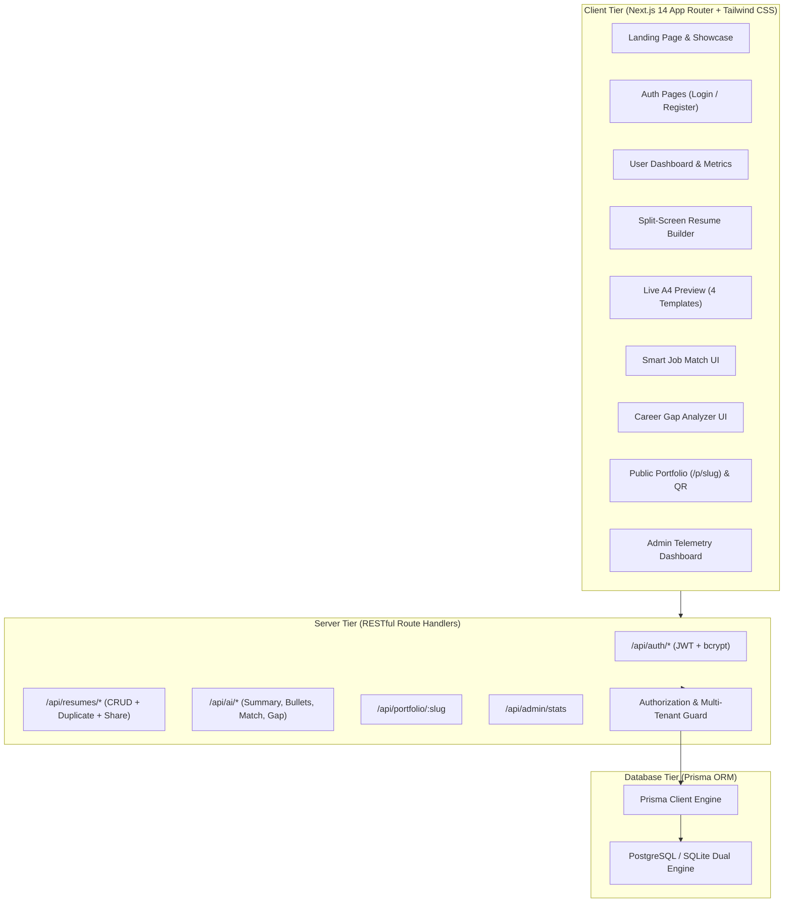

# 🚀 CV Crafter — AI-Powered Professional Resume Builder & Career Suite

> **BCA Major Degree Project (2026)**  
> *A Production-Quality Full-Stack Web Application for Students, Freshers, and Software Professionals.*

---

## 📌 Executive Summary

**CV Crafter** is an enterprise-grade, full-stack web application engineered to bridge the gap between education and employment. Unlike static resume generators, CV Crafter combines **4 ATS-optimized resume templates**, a **live synchronized split-screen builder**, **Google Gemini AI content assistance**, and three industry-first features:

1. **🎯 Smart Job Match Engine**: Compares resumes against target Job Descriptions (JD), outputting a percentage match score, identified keywords, missing ATS terms, and actionable optimization advice.
2. **🧭 Career Gap Analyzer**: Benchmarks student resumes against role profiles (*Frontend, Backend, Full-Stack, Python, Data Analyst*), generating readiness scores and a structured 12-week learning roadmap with free verified resources.
3. **🌐 Resume-to-Portfolio Website with QR Code**: Turns any resume into a shareable personal portfolio (`/p/[slug]`) with privacy toggles and scannable QR code generation for business cards and viva presentations.

---

## 🛠️ Technology Stack & Architecture



- **Frontend**: Next.js 14, React 18, TypeScript, Tailwind CSS, Lucide React, `next-themes` (Dark/Light mode).
- **Backend**: Next.js App Router Server Handlers, Zod Validation, JWT session tokens via HTTP-only Cookies.
- **Database**: PostgreSQL (production) & SQLite (zero-config local dev), Prisma ORM Client v5.
- **AI Engine**: Google Gemini API (`@google/genai` with `gemini-3.8-flash`) + Intelligent Local Algorithmic Fallback.
- **Document Export**: Precision A4 Print Stylesheet (`@media print`) and vector canvas rendering.
- **QR Code Engine**: Client-side SVG/PNG matrix encoder (`qrcode`).

---

## ✨ Key Features & Capabilities

### 1. Four Distinct Resume Templates
- **Modern Professional**: 2-Column format with dark navy/slate accents, dedicated skills & education sidebar.
- **Minimal ATS-Friendly**: Streamlined single-column typography designed for 100% parseability by applicant tracking systems.
- **Creative Portfolio**: Banner header, colored skill badges, and project showcase with live demo links.
- **Student / Fresher Resume**: Prioritizes Education, Academic Projects, Coursework, CGPA, and Hackathon honors.
- *Switch templates instantly at any time without losing a single character of your data.*

### 2. Live Split-Screen Editor & Autosave
- Side-by-side editing and synchronized live preview on desktop.
- Mobile toggle tab between Editor and Preview.
- 10 comprehensive sections: Personal Information, Professional Summary, Education, Experience, Skills, Projects, Certifications, Achievements, Languages, Custom Sections.
- Debounced background autosave with visual status indicator (*"Saved to cloud"*, *"Saving..."*).

### 3. Smart Job Match Engine
- Paste any recruiter's Job Description (JD).
- Instant calculation of **Match Score (0% - 100%)** with visual progress indicator.
- Extraction of matching skills vs missing critical ATS keywords.
- 1-Click "Add Missing Skill" button directly into your resume.

### 4. Career Gap Analyzer & Phased Roadmap
- Benchmark against 5 target roles: *Frontend Developer*, *Backend Developer*, *Full-Stack Developer*, *Python Developer*, *Data Analyst*.
- Computes role readiness score (%) and bridges skills gaps.
- Generates a **12-Week Phased Learning Roadmap** with milestone projects and curated free resources.

### 5. Resume-to-Portfolio Website with QR Code
- Converts your resume into an interactive personal website at `/p/your-slug`.
- Public / Private switch with instant live update.
- Generates a downloadable high-resolution QR Code (PNG) to print on physical resumes or presentation slides.

### 6. Security & Multi-Tenancy
- Passwords hashed using `bcrypt` with salt rounds = 10.
- Sessions stored in secure, `HTTPOnly`, `SameSite=Lax` cookies.
- Strict authorization checks on all CRUD operations: User A cannot read, edit, or delete User B's resume.

---

## ⚡ Quick Start & Setup Instructions

### Prerequisites
- Node.js 18.x or 20.x installed.
- npm 9+ or 10+.

### 1. Clone & Install Dependencies
```bash
cd "cv crafter"
npm install
```

### 2. Configure Environment Variables
Copy `.env.example` to `.env`:
```env
# Database URL (SQLite out of the box; PostgreSQL connection supported)
DATABASE_URL="file:./dev.db"

# JWT Secret
JWT_SECRET="cvcrafter-super-secret-jwt-key-for-bca-college-project-2026"

# Google Gemini API Key (Optional: for AI generation; smart fallback active if empty)
GEMINI_API_KEY=""

# Application Base URL
NEXT_PUBLIC_APP_URL="http://localhost:3000"
```

### 3. Initialize & Seed Database
```bash
# Push database schema
npm run db:push

# Seed demo users and sample resumes
npm run db:seed
```

### 4. Start Development Server
```bash
npm run dev
```
Open **[http://localhost:3000](http://localhost:3000)** in your browser.

---

## 🐳 PostgreSQL Docker Setup (Optional)

If you prefer running real PostgreSQL:
```bash
# Start PostgreSQL container
docker compose up -d

# Switch Prisma to PostgreSQL
npm run db:use-postgres

# Push schema and seed
npm run db:push
npm run db:seed
```
To switch back to zero-dependency SQLite at any time:
```bash
npm run db:use-sqlite
npm run db:push
npm run db:seed
```

---

## 🔑 Pre-Configured Demo Accounts (For Viva Evaluation)

| Role | Email | Password | Pre-loaded Features |
| :--- | :--- | :--- | :--- |
| **Student / Fresher** | `demo@cvcrafter.com` | `password123` | Pre-loaded BCA Student resume & Senior Full-Stack resume with live public portfolios (`/p/rohit-sharma`, `/p/priya-patel`) |
| **Admin User** | `admin@cvcrafter.com` | `admin123` | Access to `/admin` telemetry portal with platform metrics and user audit logs |

*Pro-tip for Viva Presentation: On the login page, click the **"1-Click Demo Login"** buttons to auto-fill credentials instantly!*

---

## 📚 RESTful API Documentation

| Method | Endpoint | Access | Description |
| :--- | :--- | :--- | :--- |
| `POST` | `/api/auth/register` | Public | Registers a new user account with hashed password |
| `POST` | `/api/auth/login` | Public | Authenticates credentials, issues JWT cookie |
| `POST` | `/api/auth/logout` | Public | Clears session cookie |
| `GET` | `/api/auth/me` | Authenticated | Fetches current user profile |
| `GET` | `/api/resumes` | Authenticated | Lists all resumes belonging to user with search & sort |
| `POST` | `/api/resumes` | Authenticated | Creates a new resume |
| `GET` | `/api/resumes/:id` | Authenticated | Retrieves single resume (with ownership verification) |
| `PUT` | `/api/resumes/:id` | Authenticated | Updates resume title, template, or content |
| `DELETE` | `/api/resumes/:id` | Authenticated | Deletes resume (with ownership verification) |
| `POST` | `/api/resumes/:id/duplicate` | Authenticated | Clones resume with "(Copy)" suffix |
| `POST` | `/api/resumes/:id/share` | Authenticated | Updates public/private status and custom slug |
| `POST` | `/api/ai/summary` | Authenticated | Generates tailored professional summary |
| `POST` | `/api/ai/enhance-bullet` | Authenticated | Polishes bullet points with active verbs & metrics |
| `POST` | `/api/ai/job-match` | Authenticated | Evaluates resume against target Job Description |
| `POST` | `/api/ai/career-gap` | Authenticated | Evaluates resume against target role benchmark |
| `GET` | `/api/portfolio/:slug` | Public | Serves sanitized public portfolio data |
| `GET` | `/api/admin/stats` | Admin Only | Platform telemetry and metrics |

---

## 🎓 BCA Viva Presentation Guide & FAQs

### Q1: What is the architectural pattern used in CV Crafter?
**Answer**: CV Crafter uses a **Next.js 14 Full-Stack App Router architecture**. The frontend uses React server and client components styled with Tailwind CSS. The backend utilizes Next.js API Route Handlers conforming to RESTful standards. Data persistence is managed via Prisma ORM interfacing with PostgreSQL/SQLite.

### Q2: How does CV Crafter prevent unauthorized resume access?
**Answer**: Multi-tenant authorization is strictly enforced on every protected route. When an API call (`GET`, `PUT`, `DELETE`) is made to `/api/resumes/:id`, the server verifies the JWT token from the secure cookie, extracts `session.id`, and validates that `resume.userId === session.id`. If a user attempts to tamper with the URL ID, the server immediately returns `403 Forbidden` or `404 Not Found`.

### Q3: How is password security implemented?
**Answer**: Passwords are never stored in plain text. During registration, the application utilizes `bcryptjs` with 10 salt rounds to compute a cryptographic one-way hash. When logging in, `bcrypt.compare()` verifies the entered password against the stored hash.

### Q4: How does the PDF generation guarantee accurate formatting?
**Answer**: Rather than relying on rigid server-side rasterization that often distorts fonts, CV Crafter implements precise CSS `@media print` rules:
- Forces ISO A4 page dimensions (`@page { size: A4; margin: 10mm; }`).
- Hides all non-printable chrome (navbars, toolbars, buttons).
- Enforces `break-inside: avoid;` on sections to prevent awkward page splits in the middle of sentences or headings.

### Q5: How does the Smart Job Match Engine parse keywords without external services?
**Answer**: CV Crafter uses a hybrid NLP tokenization and regex boundary algorithm against a curated dictionary of over 60 industry-standard technologies and methodologies. It normalizes terms (e.g., matching "React" with "React.js" or "Postgres" with "PostgreSQL"), extracts matching keywords, pinpoints omissions, and computes a weighted percentage score. If a `GEMINI_API_KEY` is present, it can also invoke Gemini 3.8 Flash for deeper semantic context.

---

## 📄 License & Credits
Developed by **Rohit Sharma** as a Bachelor of Computer Applications (BCA) Final Year Major Project (2026).
All code is open-source and released under the MIT License.
